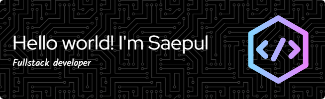

## Hi there, I'm Saepul 👋

<!--
**Saepulsaepul/Saepulsaepul** is a ✨ _special_ ✨ repository because its `README.md` (this file) appears on your GitHub profile.

Here are some ideas to get you started:

- 🔭 I’m currently working on ...
- 🌱 I’m currently learning ...
- 👯 I’m looking to collaborate on ...
- 🤔 I’m looking for help with ...
- 💬 Ask me about ...
- 📫 How to reach me: ...
- 😄 Pronouns: ...
- ⚡ Fun fact: ...
-->

- 🔭 I’m currently working on: **Dental Clinic Management System** using Laravel & Livewire
- 🌱 I’m currently learning: **Flutter**, and advanced **Laravel 11**
- 💬 Ask me about: Laravel, Livewire, Flutter, MySQL, and anything related to full-stack development
- 📍 Based in: Indonesia

##### 👩‍💻 Skills

##### 🚀 Frameworks & Library

##### 🖍 Design

